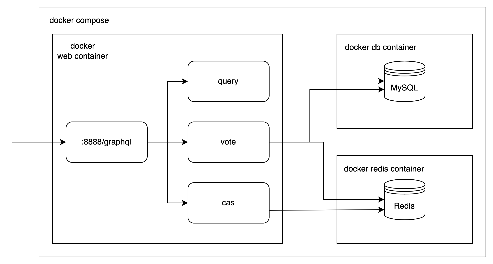

# Tiny Vote

## Structure
Use `gin` as the web framework and the router information can be seen in `router/router.go`.


## Environment preparation
Install `docker` and `docker-compose` on your machine.

Launch `docker`.

## One-click deployment
Deploy web, mysql, and redis services with docker-compose.
```shell
docker-compose up -d
```

## Running the automation testings
```shell
go test ./...
```

## Manual test
For simplicity, you can edit `refreshInterval` in `method/ticket_generation.go` to delay the ticket refresh.

You can access the web service both through api or Graphql Playground provided by `graphql-go`(`http://127.0.0.1:8888/graphql`).

### query
Get the votes of `Alice`.
```
query {
  query (name: "Alice")
}
```
### cas
Get the valid ticket now.
```
query {
   cas
}
```
### vote
Vote to `Alice`, `Bob` and `Nobody`.

The value of ticket should be replaced by the value you get from `cas`.
```
mutation {
  vote (name: ["Alice", "Bob", "Nobody"], ticket: "ojIYxyeSxZyfroRODMbN")
} 
```
